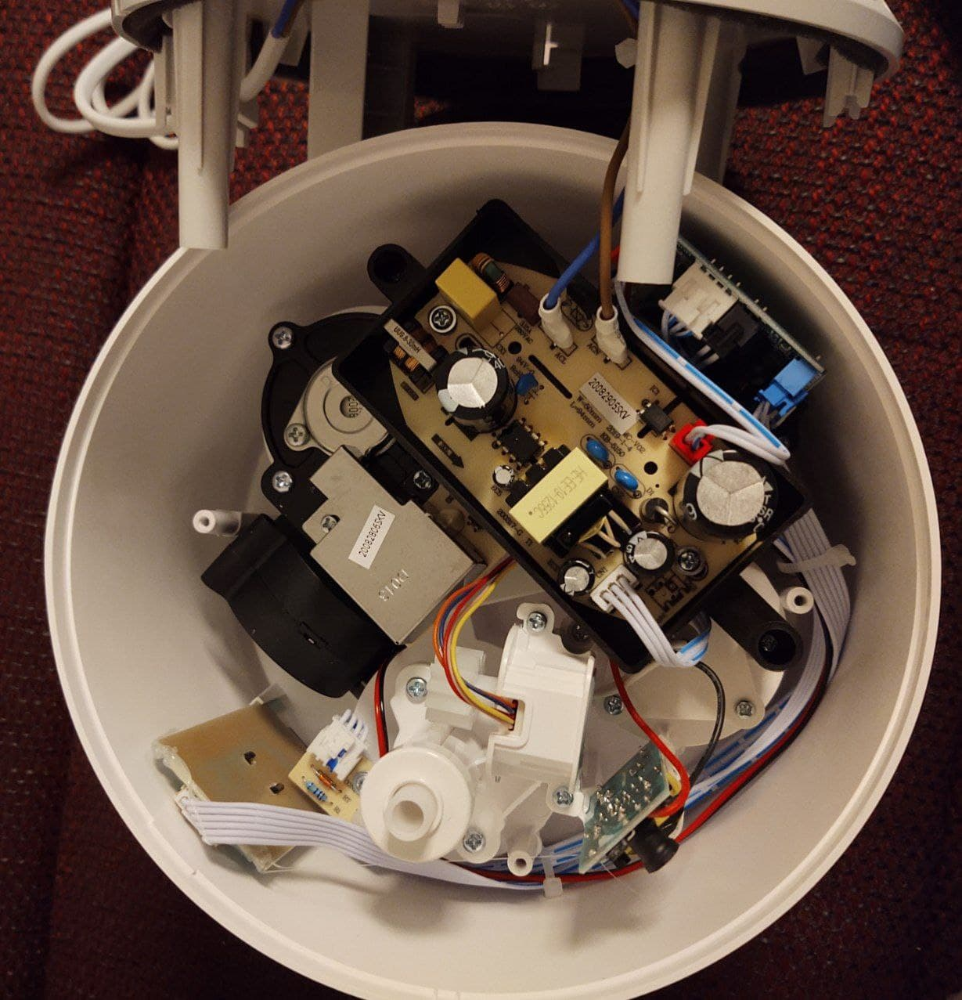

<div align="center">
    
    <p align="center"><h2>Free your humidifier from the cloud</h2></p>
</div>

This is a custom firmware for the ESP8285-based Wi-Fi module of the Xiaomi Mi Smart Antibacterial Humidifier,
which replaces cloud connectivity with local mqtt controls. Some disassembly and soldering required.

The internal Mi Model ID of the supported device is `deerma.humidifier.jsq`.
The Model on the packaging being `ZNJSQ01DEM`.

Home Assistant Autodiscovery for all features is supported and requires Home Assistant >= 2021.11.
The WifiManager library is used for on-the-fly configuration. You can even press and hold the wifi button on the device to restart the configuration.
Also, ArduinoOTA is used, so that firmware updates are possible even with a reassembled device.

If you're looking for the exact opposite of this, check out [esp8266-midea-dehumidifier](https://github.com/Hypfer/esp8266-midea-dehumidifier/).
Or maybe even use both simultaneously and see who wins?

Furthermore, this codebase may also serve as a starting point to write replacement firmwares for other Mi devices using the same module (of which there are _many_).

Here's the cloud-free humidifier in action


## Prerequisites

To replace the firmware of the official Wi-Fi module, you will need

- A 3.3v USB TTL UART Adapter
- Some dupont cables for temporary attachment
- A soldering iron
- A PH2 Screwdriver

Keep in mind that unless you backup the original firmware, there's no way to restore the module to its factory state.

Personally, that doesn't really bother me since it's a 50€ device. Therefore, I cannot help you with the firmware backup.

## Usage

If you're using Home Assistant, the MQTT Autodiscovery should do its job and provide you with a new Device like this:


In any case, communication is done via a few MQTT Topics:

- `esp8266-deerma-humidifier/HUMIDIFIER-%CHIP_ID%/status`
- `esp8266-deerma-humidifier/HUMIDIFIER-%CHIP_ID%/state`
- `esp8266-deerma-humidifier/HUMIDIFIER-%CHIP_ID%/command`

`/status` will either contain `online` or `offline` and is also used for the LWT.

`/state` will contain a JSON state which looks like this:
```json
{
	"state": "on",
	"mode": "setpoint",
	"humiditySetpoint": 45,
	"humidity": 41,
	"temperature": 24,
	"sound": "off",
	"led": "off",
	"waterTank": "full",
	"wifi": {
		"ssid": "Das IoT",
		"ip": "10.0.13.37",
		"rssi": -51
	}
}
```

and of course you can control the device via the `/control` topic which expects the same JSON structure as the state provides.<br/>
That also means that you can run multiple commands at once. For example if you wanted to turn LED off but Sound on, you'd publish

```json
{
	"sound": "on",
	"led": "off"
}
```

to the command topic. Keep in mind, that obviously not all state properties are writable.


If you ever want to update the firmware, you can do so without disassembly thanks to ArduinoOTA.
The default password is the hostname, which is mostly there to prevent accidental firmware updates.

## Installation

First, you will need to unscrew the base of the unit.<br/>
As you can see, I tried drilling holes into the rubber ring where the screws are to do that without removing it. It didn't work.<br/>
Just remove it. The ring will stick well enough even after being removed twice.<br/><br/>


Then, you'll get this view. You're only interested in the Wi-Fi module, which can be found on the bottom-left.



Here's a picture of the wifi module taken from the humidifier. It's labelled `DJD-MI-WIFI-V01`. Hello Google traveller :)


Now, you need to solder a few temporary dupont cables to the ESP module so that you can flash it.<br/>
As you can see, there are some testpoints that can be used to make this easier.


In this picture, the colors of the wires correspond to the following:

- Orange: GND
- Grey: VCC (3.3v!)
- Yellow (GPIO 0)
- Brown: RX
- Red: TX

To flash the ESP8266 module, you need to connect these to your USB UART adapter. Don't forget to Swap RX and TX.<br/>
You may also want to solder the Yellow GPIO 0 cable to the pin right below it, since it needs to be pulled low on boot so
that the ESP enters UART Download mode.

Furthermore, the 3.3v power source of most USB TTL adapters isn't powerful enough to also support the ESP.
Therefore, you need to use a different power source with the same GND.<br/>
If you have some NodeMCU, Arduinos, Wemos D1 or basically anything like that lying around, you can simply use the 
step-down converter of that module.<br/>
Simply also plug that thing into your computer used for flashing and connect the Grey wire to it's 3.3v Pins.

The firmware can then be built and flashed using the Arduino IDE.

For this, you will need to add ESP8266 support to it by [using the Boards Manager](https://github.com/esp8266/Arduino#installing-with-boards-manager).

Furthermore, you will also need to install the following libraries using the Library Manager:

* ArduinoOTA 1.0.3
* ArduinoJSON 6.10.1
* PubSubClient 2.8.0
* WiFiManager 0.15.0
